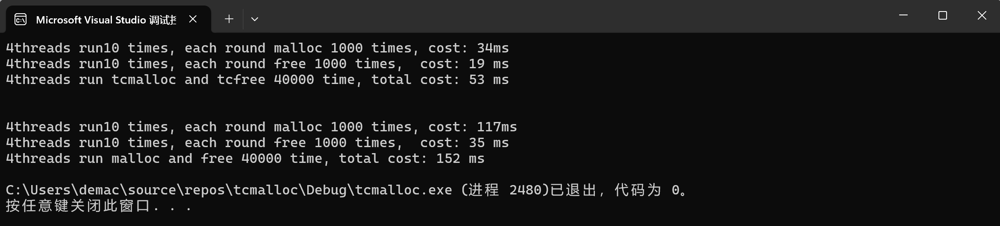
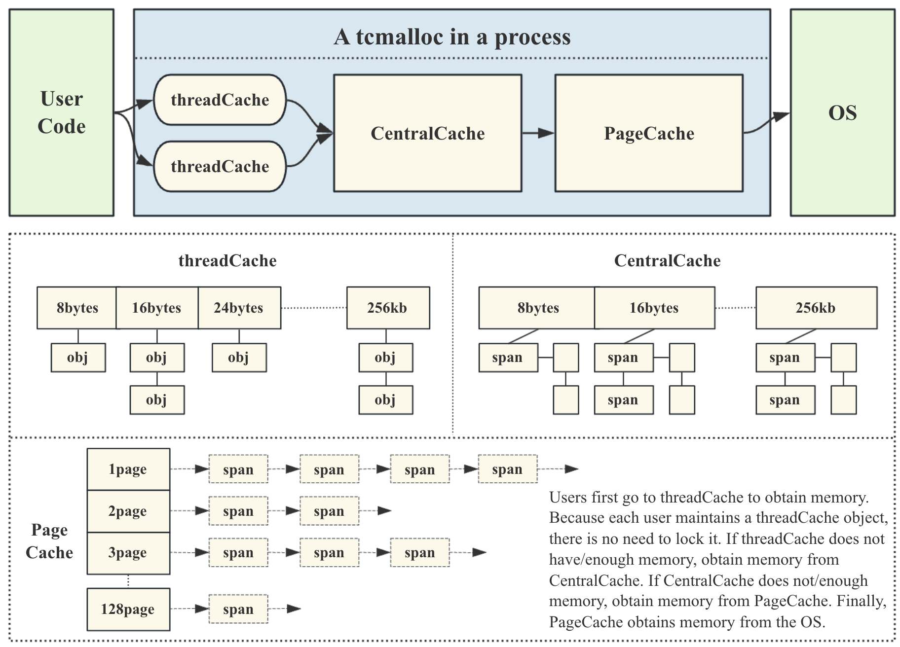

# Google-tcmalloc-simulation-implementation

谷歌开源项目tcmalloc高并发内存池学习和模拟实现

## 🔧bugs to fix

1. 在ubuntu_arm64环境下，如果调用多线程，出现段错误（原因未知，待解决） **[issues#7](https://github.com/ffengc/Google-tcmalloc-simulation-implementation/issues/7)**
2. 在ubuntu_arm64环境下，radix tree需要用第三棵，前两棵用不了，需要解决。**[issues#7](https://github.com/ffengc/Google-tcmalloc-simulation-implementation/issues/7)**
3. 在window32位环境下，可以偶尔成功运行，出现偶发段错误，原因未知，待解决。**[issues#8](https://github.com/ffengc/Google-tcmalloc-simulation-implementation/issues/8)**

经过radixtree优化后，模拟实现的tcmalloc效率高于malloc。(win32下测试，会出现偶发段错误)

## 💻项目基本信息

当前项目是实现一个高并发的内存池，他的原型是google的一个开源项目tcmalloc，tcmalloc全称 Thread-Caching Malloc，即线程缓存的malloc，实现了高效的多线程内存管理，用于替代系统的内存分配相关的函数(malloc、free)。
这个项目是把tcmalloc最核心的框架简化后拿出来，模拟实现出一个自己的高并发内存池，目的就是学习tcamlloc的精华，这种方式有点类似我们之前学习STL容器的方式。但是相比STL容器部分，tcmalloc的代码量和复杂度上升了很多。

**另一方面tcmalloc是全球大厂google开源的，可以认为当时顶尖的C++高手写出来的，他的知名度也是非常高的，不少公司都在用它，Go语言直接用它做了自己内存分配器。所以很多程序员是熟悉这个项目的。**

现代很多的开发环境都是多核多线程，在申请内存的场景下，必然存在激烈的锁竞争问题。malloc本身其实已经很优秀，那么我们项目的原型tcmalloc就是在多线程高并发的场景下更胜一筹，所以这次我们实现的内存池需要考虑以下几方面的问题。
1. 性能问题。
2. 多线程环境下，锁竞争问题。 
3. 内存碎片问题。
   
**concurrent memory pool主要由以下3个部分构成：**
1. **thread cache:** 线程缓存是每个线程独有的，用于小于256KB的内存的分配，线程从这里申请内存不需要加锁，每个线程独享一个cache，这也就是这个并发线程池高效的地方。有几个线程，就会创建几个threadCache，每个线程都独享一个Cache。threadCache如果没有内存了，就去找centralCache
2. **central cache:** 中心缓存是所有线程所共享，thread cache是按需从central cache中获取的对象。central cache合适的时机回收thread cache中的对象，避免一个线程占用了太多的内存，而 其他线程的内存吃紧，达到内存分配在多个线程中更均衡的按需调度的目的。central cache是存在竞争的，**所以从这里取内存对象是需要加锁，首先这里用的是桶锁，其次只有threadCache的没有内存对象时才会找central cache，所以这里竞争不会很激烈。如果两个threadCache去不同的桶找内存，不用加锁！**
3. **page cache:** 页缓存是在central cache缓存上面的一层缓存，存储的内存是以页为单位存储及分配的，centralCache没有内存对象时，从pageCache分配出一定数量的page，并切割成定长大小的小块内存，分配给centralCache。当一个span的几个跨度页的对象都回收以后，pageCache 会回收centralCache满足条件的span对象，并且合并相邻的页，组成更大的页，缓解内存碎片的问题。

项目结构图如下所示。

## 📚项目详细实现记录

- **[work.md](./work.md)**