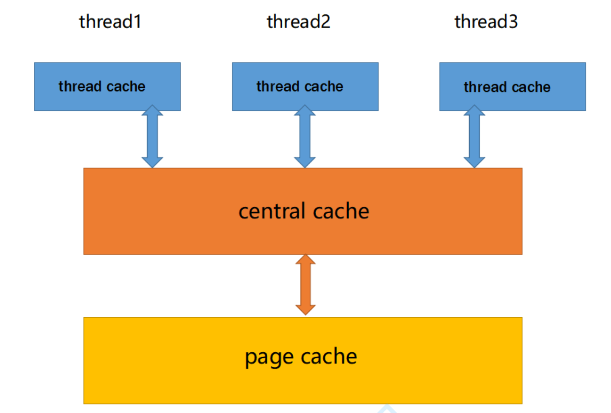

# Google-tcmalloc-simulation-implementation
谷歌开源项目tcmalloc高并发内存池学习和模拟实现

开题日期：20240504

- [Google-tcmalloc-simulation-implementation](#google-tcmalloc-simulation-implementation)
  - [前言](#前言)
  - [threadCache整体框架](#threadcache整体框架)
  - [开始写threadCache代码](#开始写threadcache代码)
  - [哈系桶的映射规则](#哈系桶的映射规则)
  - [threadCache的tls无锁访问](#threadcache的tls无锁访问)
  - [写tcfree的时候的一个遗留问题](#写tcfree的时候的一个遗留问题)
  - [central\_cache整体结构](#central_cache整体结构)
  - [central\_cache的核心逻辑](#central_cache的核心逻辑)
  - [central\_cache里面fetch\_range\_obj的逻辑](#central_cache里面fetch_range_obj的逻辑)
  - [page\_cache整体框架](#page_cache整体框架)

***

## 前言

当前项目是实现一个高并发的内存池，他的原型是google的一个开源项目tcmalloc，tcmalloc全称 Thread-Caching Malloc，即线程缓存的malloc，实现了高效的多线程内存管理，用于替代系统的内存分配相关的函数(malloc、free)。
这个项目是把tcmalloc最核心的框架简化后拿出来，模拟实现出一个自己的高并发内存池，目的就是学习tcamlloc的精华，这种方式有点类似我们之前学习STL容器的方式。但是相比STL容器部分，tcmalloc的代码量和复杂度上升了很多。

**另一方面tcmalloc是全球大厂google开源的，可以认为当时顶尖的C++高手写出来的，他的知名度也是非常高的，不少公司都在用它，Go语言直接用它做了自己内存分配器。所以很多程序员是熟悉这个项目的。**

现代很多的开发环境都是多核多线程，在申请内存的场景下，必然存在激烈的锁竞争问题。malloc本身其实已经很优秀，那么我们项目的原型tcmalloc就是在多线程高并发的场景下更胜一筹，所以这次我们实现的内存池需要考虑以下几方面的问题。
1. 性能问题。
2. 多线程环境下，锁竞争问题。 
3. 内存碎片问题。
   
**concurrent memory pool主要由以下3个部分构成：**
1. **thread cache:** 线程缓存是每个线程独有的，用于小于256KB的内存的分配，线程从这里申请内存不需要加锁，每个线程独享一个cache，这也就是这个并发线程池高效的地方。有几个线程，就会创建几个threadCache，每个线程都独享一个Cache。threadCache如果没有内存了，就去找centralCache
2. **central cache:** 中心缓存是所有线程所共享，thread cache是按需从central cache中获取的对象。central cache合适的时机回收thread cache中的对象，避免一个线程占用了太多的内存，而 其他线程的内存吃紧，达到内存分配在多个线程中更均衡的按需调度的目的。central cache是存在竞争的，**所以从这里取内存对象是需要加锁，首先这里用的是桶锁，其次只有threadCache的没有内存对象时才会找central cache，所以这里竞争不会很激烈。如果两个threadCache去不同的桶找内存，不用加锁！**
3. **page cache:** 页缓存是在central cache缓存上面的一层缓存，存储的内存是以页为单位存储及分配的，centralCache没有内存对象时，从pageCache分配出一定数量的page，并切割成定长大小的小块内存，分配给centralCache。当一个span的几个跨度页的对象都回收以后，pageCache 会回收centralCache满足条件的span对象，并且合并相邻的页，组成更大的页，缓解内存碎片的问题。



## threadCache整体框架

**一个重要概念：自由链表，就是把切好的小块内存链接起来，这一块内存的前4个字节是一个指针，指向链表的下一个地方。**

如果是定长内存池，那就是一个自由链表就行了，但是现在不是定长的。

那是不是1byte一个自由链表，2一个，3一个呢，这也太多了。

规定：小于256kb的找threadCache, 大于256kb后面再说。

所以如果如果1，2，3，4比特都挂一个链表，那就是二十几万个链表，太大了！

所以如图所示，我们就这么设计。


这是一种牺牲和妥协。

## 开始写threadCache代码

首先肯定要提供这两个接口，不用说的。

thread_cache.hpp
```cpp
class thread_cache {
private:
public:
    void* allocate(size_t size);
    void deallocate(void* ptr, size_t size);
};
```

当然我们发现，控制自由链表需要一个类，然后这个类不仅threadCache要用，其他上层的也要用，所以我们写在 common.hpp 里面去。

```cpp
class free_list {
private:
    void* __free_list_ptr;
public:
    void push(void* obj);
    void* pop();
};
```

push和pop实现很简单，头插和头删就行了。

```cpp
    void push(void* obj) {
        *(void**)obj = __free_list_ptr;
        __free_list_ptr = obj;
    }
```

这个`*(void**)obj`需要理解一下，因为我们不知道当前环境下一个指针是4个字节的还是8个字节的，所以要这样才能取到指针的大小。

然后我们也可以封装一下

```cpp
class free_list {
private:
    void* __free_list_ptr;

public:
    void push(void* obj) {
        assert(obj);
        __next_obj(obj) = __free_list_ptr;
        __free_list_ptr = obj;
    }
    void* pop() {
        assert(__free_list_ptr);
        void* obj = __free_list_ptr;
        __free_list_ptr = __next_obj(obj);
    }

private:
    static void*& __next_obj(void* obj) {
        return *(void**)obj;
    }
};
```

## 哈系桶的映射规则

我们可以写一个类，去计算对象大小的对齐映射规则。

tcmalloc里面的映射规则是很复杂的，这里我们进行简化了。

映射规则如下：

整体控制在最多10%左右的内碎片浪费 

| 申请的字节数量 | 对齐数 | 自由链表里对应的范围 |
|-------|-------|-------|
| [1,128] | 8byte对齐 | freelist[0,16) |
| [128+1,1024] | 16byte对齐 | freelist[16,72) |
| [1024+1,8*1024] | 128byte对齐 | freelist[72,128) |
| [8*1024+1,64*1024] | 1024byte对齐 | freelist[128,184) |
| [64*1024+1,256*1024] | 8*1024byte对齐 | freelist[184,208) |

**这样我们可以控制最多10%的内碎片浪费，如果你申请的多，那我就允许你浪费的稍微多一点，这个也是很合理的（这个规则是本项目设定的，tcmalloc的更加复杂）**

所以我们先确定跟谁对齐，然后再找对齐数。

common.hpp
```cpp
// 计算对象大小的对齐映射规则
class size_class {
public:
    static inline size_t __round_up(size_t bytes, size_t align_number) {
        return (((bytes) + align_number - 1) & ~(align_number - 1));
    }
    static inline size_t round_up(size_t size) {
        if (size <= 128)
            return __round_up(size, 8);
        else if (size <= 1024)
            return __round_up(size, 16);
        else if (size <= 8 * 1024)
            return __round_up(size, 128);
        else if (size <= 64 * 1024)
            return __round_up(size, 1024);
        else if (size <= 256 * 1024)
            return __round_up(size, 8 * 1024);
        else {
            assert(false);
            return -1;
        }
    }
};
```

如何理解这个代码。

```cpp
    size_t __round_up(size_t size, size_t align_number) {
        return (((bytes) + align_number - 1) & ~(align_number - 1));
    }
```

大佬想出来的，我们可以测试几个。

thread_cache.cc
```cpp
void* thread_cache::allocate(size_t size) {
    assert(size <= MAX_BITES);
    size_t align_size = size_class::round_up(size);
}
```
现在我们就可以获得对齐之后的大小了！也就是说，你申请size字节，我会给你align_size字节。
那么是在哪一个桶里面取出来的这一部分内存呢？所以我们还要写方法去找这个桶在哪。


```cpp
    // 计算映射的哪一个自由链表桶
    static inline size_t __bucket_index(size_t bytes, size_t align_shift) {
        return ((bytes + (1 << align_shift) - 1) >> align_shift) - 1;
        /* 
            这个还是同一道理，bytes不是对齐数的倍数，那就是直接模就行了 
            如果是，那就特殊规则一下即可，比如 1~128字节，对齐数字是8
            那就是 bytes / 8 + 1 就是几号桶了
            如果 bytes % 8 == 0 表示没有余数，刚好就是那个桶，就不用+1
            这个也很好理解
        */
    }
    static inline size_t bucket_index(size_t bytes) {
        assert(bytes <= MAX_BYTES);
        // 每个区间有多少个链
        static int group_array[4] = { 16, 56, 56, 56 };
        if (bytes <= 128) {
            return __bucket_index(bytes, 3);
        } else if (bytes <= 1024) {
            return __bucket_index(bytes - 128, 4) + group_array[0];
        } else if (bytes <= 8 * 1024) {
            return __bucket_index(bytes - 1024, 7) + group_array[1] + group_array[0];
        } else if (bytes <= 64 * 1024) {
            return __bucket_index(bytes - 8 * 1024, 10) + group_array[2] + group_array[1]
                + group_array[0];
        } else if (bytes <= 256 * 1024) {
            return __bucket_index(bytes - 64 * 1024, 13) + group_array[3] + group_array[2] + group_array[1] + group_array[0];
        } else {
            assert(false);
        }
        return -1;
    }
```

这个其实也是很好理解的，因为每个对齐区间有多少个桶已经确定了：

如果按照8对齐：16个桶
如果按照16对齐：56个桶
...

然后bucket_index里面，为什么后面要+group_array的数字，因为__bucket_index只算出来了你是这一组的第几个，不是在全部桶里面的第几个。

> 比如你是按照16对齐的，你的桶的编号肯定是大于16了，因为按照8对齐的已经用了16个桶了，所以你肯定是第17个桶开始。那么__bucket_index可以告诉你，你是按照16对齐的这56个桶里的第一个，在这一组里面你是第一个桶，但是在全部桶里面，你是第17个桶了。

然后thread_cache.cc这里面就可以完善了。

```cpp
void* thread_cache::allocate(size_t size) {
    assert(size <= MAX_BYTES);
    size_t align_size = size_class::round_up(size);
    size_t bucket_index = size_class::bucket_index(size);
    if (!__free_lists[bucket_index].empty()) {
        return __free_lists[bucket_index].pop();
    } else {
        // 这个桶下面没有内存了！找centralCache找
        return fetch_from_central_cache(bucket_index, align_size);
    }
}
```

## threadCache的tls无锁访问

首先，如果我们了解过操作系统相关知识，我们就知道，进程里面（包括线程）这些，都是共享的。也就是说，如果我们不加处理，我们创建的threadCache是所有线程都能访问的。

这个不是我们想要的，我们需要的是，每一个线程都有自己的threadCache!

> 线程局部存储（TLS），是一种变量的存储方法，这个变量在它所在的线程内是全局可访问的，但是不能被其他线程访问到，这样就保持了数据的线程独立性。而熟知的全局变量，是所有线程都可以访问的，这样就不可避免需要锁来控制，增加了控制成本和代码复杂度。


然后linux下这样操作就行了。

thread_cache.hpp
```cpp
__thread thread_cache* p_tls_thread_cache = nullptr;
```

windows下这样写

```cpp
__thread static thread_cache* p_tls_thread_cache = nullptr;
```

这个也很好理解了，这样声明这个变量之后，这个p_tls_thread_cache变量就会每个线程独享一份。

然后我们调用的时候，也不可能让别人直接去调用thread_cache.cc里面的alloc，所以，我们再弄一个文件，提供一个调用的接口。

tcmalloc.hpp
```cpp
static void* tcmalloc(size_t size) {
    if (p_tls_thread_cache == nullptr)
        // 相当于单例
        p_tls_thread_cache = new thread_cache;
    return p_tls_thread_cache->allocate(size);
}

static void tcfree(size_t size) {
}
#endif
```

## 写tcfree的时候的一个遗留问题

tcmalloc.hpp
```cpp
static void tcfree(void* ptr, size_t size) {
    assert(p_tls_thread_cache);
    p_tls_thread_cache->deallocate(ptr, size);
}
```

thread_cache.cc
```cpp
void thread_cache::deallocate(void* ptr, size_t size) {
    assert(ptr);
    assert(size <= MAX_BYTES);
    size_t index = size_class::bucket_index(size);
    __free_lists[index].push(ptr);
}
```

我这里是要传大小的，但是呢，p_tls_thread_cache->deallocate()需要给size，不然不知道还到哪一个桶上。但是我们的free是不用传size的，这里如何解决？

目前解决不了，先保留这个问题，留到后面再解决。

## central_cache整体结构

centralCache也是一个哈希桶结构，他的哈希桶的映射关系跟threadCache是一样的。不同的是他的每个哈希桶位置挂是SpanList链表结构，不过每个映射桶下面的span中的大内存块被按映射关系切成了一个个小内存块对象挂在span的自由链表中。

这里是需要加锁的，但是是桶锁。如果不同线程获取不同的桶的东西，就不用加锁。


**申请内存:**
1. 当thread cache中没有内存时，就会批量向central cache申请一些内存对象，这里的批量获取对 象的数量使用了类似网络tcp协议拥塞控制的慢开始算法;central cache也有一个哈希映射的 spanlist，spanlist中挂着span，从span中取出对象给thread cache，这个过程是需要加锁的，不 过这里使用的是一个桶锁，尽可能提高效率。
2. central cache映射的spanlist中所有span的都没有内存以后，则需要向page cache申请一个新的 span对象，拿到span以后将span管理的内存按大小切好作为自由链表链接到一起。然后从span 中取对象给thread cache。
3. central cache的中挂的span中use_count记录分配了多少个对象出去，分配一个对象给thread cache，就++use_count


**释放内存:**

1. 当threadCache过长或者线程销毁，则会将内存释放回centralCache中的，释放回来时--use_count。当use_count减到0时则表示所有对象都回到了span，则将span释放回pageCache，pageCache中会对前后相邻的空闲页进行合并。

**centralCache里面的小对象是由大对象切出来的，大对象就是Span。**

span的链表是双向链表。

span除了central_cache要用，后面的page_cache也要用，所以定义到common里面去吧。

然后这里存在一个问题，就是这个size_t，在64位下不够了，需要条件编译处理一下。

common.hpp
```cpp
#if defined(_WIN64) || defined(__x86_64__) || defined(__ppc64__) || defined(__aarch64__)
typedef unsigned long long PAGE_ID;
#else
typedef size_t PAGE_ID;
#endif
```

这里如果在windows下有个坑，win64下是既有win64也有win32的定义的，所以要先判断64的，避免出bug。

```cpp
// 管理大块内存
class span {
public:
    PAGE_ID __page_id; // 大块内存起始页的页号
    size_t __n; // 页的数量
    // 双向链表结构
    span* __next;
    span* __prev;
    size_t __use_count; // 切成段小块内存，被分配给threadCache的计数器
    void* __free_list; // 切好的小块内存的自由链表
};
```

然后就要手撕一个双链表了，十分简单，不多说了。这里面，每一个桶要维护一个锁！

common.hpp
```cpp
// 带头双向循环链表
class span_list {
private:
    span* __head = nullptr;
    std::mutex __bucket_mtx;
public:
    span_list() {
        __head = new span;
        __head->__next = __head;
        __head->__prev = __head;
    }
    void insert(span* pos, span* new_span) {
        // 插入的是一个完好的span
        assert(pos);
        assert(new_span);
        span* prev = pos->__prev;
        prev->__next = new_span;
        new_span->__prev = prev;
        new_span->__next = pos;
        pos->__prev = new_span;
    }
    void erase(span* pos) {
        assert(pos);
        assert(pos != __head);
        span* prev = pos->__prev;
        span* next = pos->__next;
        prev->__next = next;
        next->__prev = prev;
    }
};
```

central_cache.hpp
```cpp
#include "../common.hpp"

class central_cache {
private:
    span_list __span_lists[BUCKETS_NUM]; // 有多少个桶就多少个
public:
    
};
```

有多少个桶就有多少把锁！


## central_cache的核心逻辑

**很明显这里是比较适合使用单例模式的。因为每个进程只需要维护一个central_cache。单例模式的详细说明可以见我的博客: [单例模式](https://blog.csdn.net/Yu_Cblog/article/details/131787131)**


然后这里我们用饿汉模式。

```cpp
class central_cache {
private:
    span_list __span_lists[BUCKETS_NUM]; // 有多少个桶就多少个
private:
    static central_cache __s_inst;
    central_cache() = default; // 构造函数私有
    central_cache(const central_cache&) = delete; // 不允许拷贝
public:
    central_cache* get_instance() { return &__s_inst; }
public:
};
```


然后threadCache找你要内存了，你给多少呢？

这里用了一个类似tcp的慢开始的反馈算法。我们可以把这个算法写到size_class里面去。

common.hpp::size_class
```cpp
    // 一次threadCache从centralCache获取多少个内存
    static inline size_t num_move_size(size_t size) {
        if (size == 0)
            return 0;
        // [2, 512], 一次批量移动多少个对象的（慢启动）上限制
        // 小对象一次批量上限高
        // 大对象一次批量上限低
        int num = MAX_BYTES / size;
        if (num < 2)
            num = 2;
        if (num > 512)
            num = 512;
        return num;
    }
```

用这个方法，可以告诉threadCache，本次要从centralCache获取多少内存。

然后为了控制慢开始，在free_list里面还需要控制一个max_size，然后这个字段递增，就能控制慢启动了。

thread_cache.cc
```cpp
void* thread_cache::fetch_from_central_cache(size_t index, size_t size) {
    // 慢开始反馈调节算法
    size_t batch_num = std::min(__free_lists[index].max_size(), size_class::num_move_size(size));
    if (__free_lists[index].max_size() == batch_num)
        __free_lists[index].max_size() += 1; // 最多增长到512了
    // 1. 最开始一次向centralCache要太多，因为太多了可能用不完
    // 2. 如果你一直有这个桶size大小的内存，那么后面我可以给你越来越多，直到上限(size_class::num_move_size(size))
    //      这个上限是根据这个桶的内存块大小size来决定的
    // 3. size越大，一次向centralcache要的就越小，如果size越小，相反。
    return nullptr;
}
```


然后去调用这个fetch_range_obj函数。

参数的意义：获取一段内存，从start到end个块，一共获取batch_num个，然后每一个块的大小是size，end-start应该等于batch_num。

返回值的意义：这里向central_cache中的span获取batch_num个，那么这个span一定有这么多个吗？不一定。span下如果不够，就全部给你。actual_n表示实际获取到了多少个。 1 <= actual_n <= batch_num。


thread_cache.cc
```cpp
void* thread_cache::fetch_from_central_cache(size_t index, size_t size) {
    // 慢开始反馈调节算法
    size_t batch_num = std::min(__free_lists[index].max_size(), size_class::num_move_size(size));
    if (__free_lists[index].max_size() == batch_num)
        __free_lists[index].max_size() += 1; // 最多增长到512了
    // 1. 最开始一次向centralCache要太多，因为太多了可能用不完
    // 2. 如果你一直有这个桶size大小的内存，那么后面我可以给你越来越多，直到上限(size_class::num_move_size(size))
    //      这个上限是根据这个桶的内存块大小size来决定的
    // 3. size越大，一次向centralcache要的就越小，如果size越小，相反。

    // 开始获取内存了
    void* start = nullptr;
    void* end = nullptr;
    size_t actual_n = central_cache::get_instance()->fetch_range_obj(start, end, batch_num, size);
    return nullptr;
}
```

然后我们获取到从cc(centralCache)里面的内存了，这里分两种情况：

1. cc只给了tc一个内存块(actual_n==1时), 此时直接返回就行了。此时thread_cache::allocate会直接把获取到的这一块交给用户，不用经过tc的哈希桶了。
2. 但是如果cc给我们的是一段(actual_n>=1)，只需要给用户其中一块，其他的要插入到tc里面去！所以我们要给free_list提供一个插入一段（好几块size大小内存）的方法，也是头插就行了。

可以重载一下。

common.hpp::free_list
```cpp
    void push(void* obj) {
        assert(obj);
        __next_obj(obj) = __free_list_ptr;
        __free_list_ptr = obj;
    }
    void push(void* start, void* end) {
        __next_obj(end) = __free_list_ptr;
        __free_list_ptr = start;
    }
```

thread_cache.cc
```cpp
    if (actual_n == 1) {
        assert(start == end);
        return start;
    } else {
        __free_lists[index].push(free_list::__next_obj(start), end);
        return start;
    }

```

这里push的是start的下一个位置，start就不用经过tc了，start直接返回给用户，然后start+1到end位置的，插入到tc里面去。

## central_cache里面fetch_range_obj的逻辑

```cpp
size_t central_cache::fetch_range_obj(void*& start, void*& end, size_t batch_num, size_t size) {
    size_t index = size_class::bucket_index(size); // 算出在哪个桶找
    
}
```

算出在哪桶里面找之后，就要分情况了。

首先，如果这个桶里面一个span都没挂，那就要找下一层了，找pc要。

如果有挂一些span，也要分情况。

我们要先找到一个非空的span。

所以写一个方法，不过这个方法可以后面再实现。

然后这里要注意一下。自由链表是单链表，如果我们取一段出来，最后要记得链表末尾给一个nullptr。

**注意细节：**
1. 取batch_num个，end指针只需要走batch_num步（前提是span下面够这么多）！
2. 如果span下面不够，要特殊处理！


```cpp
size_t central_cache::fetch_range_obj(void*& start, void*& end, size_t batch_num, size_t size) {
    size_t index = size_class::bucket_index(size); // 算出在哪个桶找
    __span_lists[index].__bucket_mtx.lock(); // 加锁（可以考虑RAII）
    span* cur_span = get_non_empty_span(__span_lists[index], size); // 找一个非空的span（有可能找不到）
    assert(cur_span);
    assert(cur_span->__free_list); // 这个非空的span一定下面挂着内存了，所以断言一下

    start = cur_span->__free_list;
    // 这里要画图理解一下
    end = start;
    // 开始指针遍历，从span中获取对象，如果不够，有多少拿多少
    size_t i = 0;
    size_t actual_n = 1;
    while (i < batch_num - 1 && free_list::__next_obj(end) != nullptr) {
        end = free_list::__next_obj(end);
        ++i;
        ++actual_n;
    }
    cur_span->__free_list = free_list::__next_obj(end);
    free_list::__next_obj(end) = nullptr;
    __span_lists[index].__bucket_mtx.unlock(); // 解锁
    return actual_n;
}
```

当然cc到这里还没有完全写完的，但是我们要继续先写pc，才能来完善这里的部分。

## page_cache整体框架