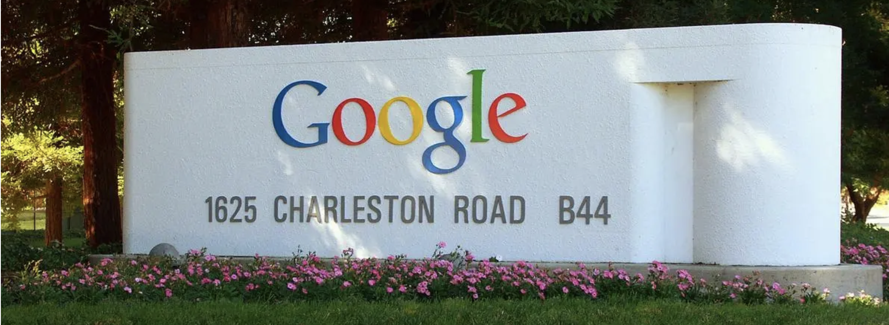

# Google-tcmalloc-simulation-implementation

Google open source project tcmalloc high concurrency memory pool learning and simulation implementation.

- **[Google TcMalloc repo link](https://github.com/google/tcmalloc)**

## 🔧bugs to fix

1. In the ubuntu_arm64 environment, if multithreading is called, a segmentation fault occurs (the reason is unknown and needs to be resolved). **[issues#7](https://github.com/ffengc/Google-tcmalloc-simulation-implementation/issues/7)**
2. In the ubuntu_arm64 environment, the third radix tree needs to be used. The first two cannot be used and need to be resolved. **[issues#7](https://github.com/ffengc/Google-tcmalloc-simulation-implementation/issues/7)**
3. In the Window 32-bit environment, it can occasionally run successfully, but occasional segmentation errors occur. The reason is unknown and needs to be resolved. **[issues#8](https://github.com/ffengc/Google-tcmalloc-simulation-implementation/issues/8)**

After radixtree optimization, the efficiency of the simulated tcmalloc is higher than that of malloc. (Tested under win32, occasional segmentation errors may occur)

## 💻Basic information of the project

The current project is to implement a high-concurrency memory pool. Its prototype is an open source project of Google called tcmalloc. The full name of tcmalloc is Thread-Caching Malloc, which is a thread-cached malloc. It implements efficient multi-threaded memory management and is used to replace the system's memory allocation related functions (malloc, free).
This project simplifies the core framework of tcmalloc and simulates a high-concurrency memory pool of its own. The purpose is to learn the essence of tcmalloc. This method is somewhat similar to the way we learned STL containers before. However, compared with the STL container part, the amount of code and complexity of tcmalloc have increased a lot.

**On the other hand, tcmalloc is open sourced by Google, a global giant. It can be considered that it was written by the top C++ experts at the time. It is also very well-known. Many companies are using it. Go language directly uses it as its own memory allocator. Therefore, many programmers are familiar with this project.**

Many modern development environments are multi-core and multi-threaded. When applying for memory, there will inevitably be fierce lock competition. Malloc itself is actually very good, so the prototype of our project, tcmalloc, is even better in the scenario of multi-threaded high concurrency, so the memory pool we implemented this time needs to consider the following issues.
1. Performance issues.
2. Lock competition issues in a multi-threaded environment.
3. Memory fragmentation issues.
   
**Concurrent memory pool is mainly composed of the following three parts:**
1. **thread cache:** The thread cache is unique to each thread and is used to allocate memory less than 256KB. Threads do not need to lock when applying for memory from here. Each thread has a cache, which is where the concurrent thread pool is efficient. If there are several threads, several threadCaches will be created, and each thread has a cache. If threadCache is out of memory, it will look for centralCache
2. **central cache:** The central cache is shared by all threads. The thread cache is an object obtained from the central cache on demand. The central cache recycles objects in the thread cache at the right time to avoid one thread occupying too much memory while other threads are short of memory, so as to achieve the purpose of more balanced on-demand scheduling of memory allocation among multiple threads. There is competition in the central cache, so it is necessary to lock when taking memory objects from here. First of all, the bucket lock is used here. Secondly, the central cache will only be found when there is no memory object in the threadCache, so the competition here will not be very fierce. If two threadCaches go to different buckets to find memory, no locking is required! **
3. **page cache:** Page cache is a cache layer above the central cache. The memory is stored and allocated in pages. When there is no memory object in centralCache, a certain number of pages are allocated from pageCache and cut into small blocks of fixed length and allocated to centralCache. When the objects of several span pages of a span are recycled, pageCache will recycle the span objects that meet the conditions in centralCache and merge adjacent pages to form larger pages to alleviate the problem of memory fragmentation.

The structure diagram is shown below.

## 📚Detailed project implementation records

- **[work.md](./work.md)** | **[work-cn.md (中文)](./work-cn.md)**