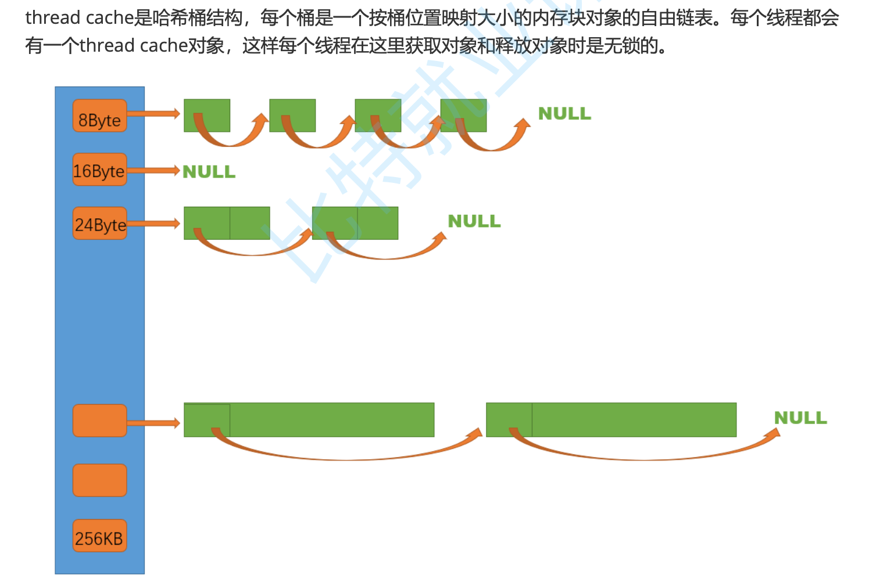
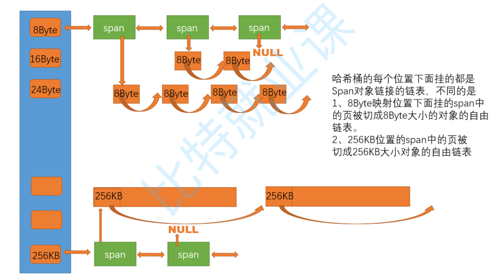
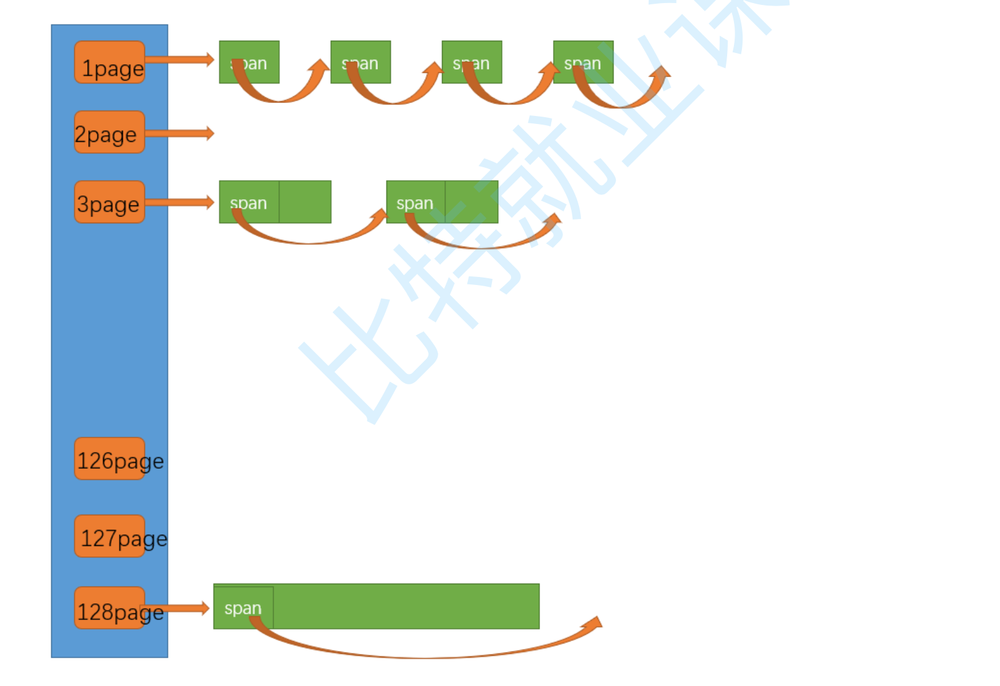

# 项目详细实现

[English](./work.md) | **中文**

- [项目详细实现](#项目详细实现)
  - [threadCache整体框架](#threadcache整体框架)
  - [开始写threadCache代码](#开始写threadcache代码)
  - [哈系桶的映射规则](#哈系桶的映射规则)
  - [threadCache的tls无锁访问](#threadcache的tls无锁访问)
  - [写tcfree的时候的一个遗留问题](#写tcfree的时候的一个遗留问题)
  - [central\_cache整体结构](#central_cache整体结构)
  - [central\_cache的核心逻辑](#central_cache的核心逻辑)
  - [central\_cache里面fetch\_range\_obj的逻辑](#central_cache里面fetch_range_obj的逻辑)
  - [page\_cache整体框架](#page_cache整体框架)
  - [获取span详解](#获取span详解)
    - [关于 new\_span 如何加锁的文字(重要/容易出bug)](#关于-new_span-如何加锁的文字重要容易出bug)
  - [内存申请流程联调](#内存申请流程联调)
  - [thread\_cache内存释放](#thread_cache内存释放)
  - [central\_cache内存释放](#central_cache内存释放)
  - [page\_cache内存释放](#page_cache内存释放)
  - [大于256k的情况](#大于256k的情况)
  - [处理代码中`new`的问题](#处理代码中new的问题)
  - [解决free，使其不用传大小](#解决free使其不用传大小)
  - [多线程场景下深度测试](#多线程场景下深度测试)
  - [分析性能瓶颈](#分析性能瓶颈)
  - [用Radix Tree进行优化](#用radix-tree进行优化)


## threadCache整体框架

**一个重要概念：自由链表，就是把切好的小块内存链接起来，这一块内存的前4个字节是一个指针，指向链表的下一个地方。**

如果是定长内存池，那就是一个自由链表就行了，但是现在不是定长的。

那是不是1byte一个自由链表，2一个，3一个呢，这也太多了。

规定：小于256kb的找threadCache, 大于256kb后面再说。

所以如果如果1，2，3，4比特都挂一个链表，那就是二十几万个链表，太大了！

所以如图所示，我们就这么设计。



这是一种牺牲和妥协。

## 开始写threadCache代码

首先肯定要提供这两个接口，不用说的。

thread_cache.hpp
```cpp
class thread_cache {
private:
public:
    void* allocate(size_t size);
    void deallocate(void* ptr, size_t size);
};
```

当然我们发现，控制自由链表需要一个类，然后这个类不仅threadCache要用，其他上层的也要用，所以我们写在 common.hpp 里面去。

```cpp
class free_list {
private:
    void* __free_list_ptr;
public:
    void push(void* obj);
    void* pop();
};
```

push和pop实现很简单，头插和头删就行了。

```cpp
    void push(void* obj) {
        *(void**)obj = __free_list_ptr;
        __free_list_ptr = obj;
    }
```

这个`*(void**)obj`需要理解一下，因为我们不知道当前环境下一个指针是4个字节的还是8个字节的，所以要这样才能取到指针的大小。

然后我们也可以封装一下

```cpp
class free_list {
private:
    void* __free_list_ptr;

public:
    void push(void* obj) {
        assert(obj);
        __next_obj(obj) = __free_list_ptr;
        __free_list_ptr = obj;
    }
    void* pop() {
        assert(__free_list_ptr);
        void* obj = __free_list_ptr;
        __free_list_ptr = __next_obj(obj);
    }

private:
    static void*& __next_obj(void* obj) {
        return *(void**)obj;
    }
};
```

## 哈系桶的映射规则

我们可以写一个类，去计算对象大小的对齐映射规则。

tcmalloc里面的映射规则是很复杂的，这里我们进行简化了。

映射规则如下：

整体控制在最多10%左右的内碎片浪费 

| 申请的字节数量 | 对齐数 | 自由链表里对应的范围 |
|-------|-------|-------|
| [1,128] | 8byte对齐 | freelist[0,16) |
| [128+1,1024] | 16byte对齐 | freelist[16,72) |
| [1024+1,8*1024] | 128byte对齐 | freelist[72,128) |
| [8*1024+1,64*1024] | 1024byte对齐 | freelist[128,184) |
| [64*1024+1,256*1024] | 8*1024byte对齐 | freelist[184,208) |

**这样我们可以控制最多10%的内碎片浪费，如果你申请的多，那我就允许你浪费的稍微多一点，这个也是很合理的（这个规则是本项目设定的，tcmalloc的更加复杂）**

所以我们先确定跟谁对齐，然后再找对齐数。

common.hpp
```cpp
// 计算对象大小的对齐映射规则
class size_class {
public:
    static inline size_t __round_up(size_t bytes, size_t align_number) {
        return (((bytes) + align_number - 1) & ~(align_number - 1));
    }
    static inline size_t round_up(size_t size) {
        if (size <= 128)
            return __round_up(size, 8);
        else if (size <= 1024)
            return __round_up(size, 16);
        else if (size <= 8 * 1024)
            return __round_up(size, 128);
        else if (size <= 64 * 1024)
            return __round_up(size, 1024);
        else if (size <= 256 * 1024)
            return __round_up(size, 8 * 1024);
        else {
            assert(false);
            return -1;
        }
    }
};
```

如何理解这个代码。

```cpp
    size_t __round_up(size_t size, size_t align_number) {
        return (((bytes) + align_number - 1) & ~(align_number - 1));
    }
```

大佬想出来的，我们可以测试几个。

thread_cache.cc
```cpp
void* thread_cache::allocate(size_t size) {
    assert(size <= MAX_BITES);
    size_t align_size = size_class::round_up(size);
}
```
现在我们就可以获得对齐之后的大小了！也就是说，你申请size字节，我会给你align_size字节。
那么是在哪一个桶里面取出来的这一部分内存呢？所以我们还要写方法去找这个桶在哪。


```cpp
    // 计算映射的哪一个自由链表桶
    static inline size_t __bucket_index(size_t bytes, size_t align_shift) {
        return ((bytes + (1 << align_shift) - 1) >> align_shift) - 1;
        /* 
            这个还是同一道理，bytes不是对齐数的倍数，那就是直接模就行了 
            如果是，那就特殊规则一下即可，比如 1~128字节，对齐数字是8
            那就是 bytes / 8 + 1 就是几号桶了
            如果 bytes % 8 == 0 表示没有余数，刚好就是那个桶，就不用+1
            这个也很好理解
        */
    }
    static inline size_t bucket_index(size_t bytes) {
        assert(bytes <= MAX_BYTES);
        // 每个区间有多少个链
        static int group_array[4] = { 16, 56, 56, 56 };
        if (bytes <= 128) {
            return __bucket_index(bytes, 3);
        } else if (bytes <= 1024) {
            return __bucket_index(bytes - 128, 4) + group_array[0];
        } else if (bytes <= 8 * 1024) {
            return __bucket_index(bytes - 1024, 7) + group_array[1] + group_array[0];
        } else if (bytes <= 64 * 1024) {
            return __bucket_index(bytes - 8 * 1024, 10) + group_array[2] + group_array[1]
                + group_array[0];
        } else if (bytes <= 256 * 1024) {
            return __bucket_index(bytes - 64 * 1024, 13) + group_array[3] + group_array[2] + group_array[1] + group_array[0];
        } else {
            assert(false);
        }
        return -1;
    }
```

这个其实也是很好理解的，因为每个对齐区间有多少个桶已经确定了：

如果按照8对齐：16个桶
如果按照16对齐：56个桶
...

然后bucket_index里面，为什么后面要+group_array的数字，因为__bucket_index只算出来了你是这一组的第几个，不是在全部桶里面的第几个。

> 比如你是按照16对齐的，你的桶的编号肯定是大于16了，因为按照8对齐的已经用了16个桶了，所以你肯定是第17个桶开始。那么__bucket_index可以告诉你，你是按照16对齐的这56个桶里的第一个，在这一组里面你是第一个桶，但是在全部桶里面，你是第17个桶了。

然后thread_cache.cc这里面就可以完善了。

```cpp
void* thread_cache::allocate(size_t size) {
    assert(size <= MAX_BYTES);
    size_t align_size = size_class::round_up(size);
    size_t bucket_index = size_class::bucket_index(size);
    if (!__free_lists[bucket_index].empty()) {
        return __free_lists[bucket_index].pop();
    } else {
        // 这个桶下面没有内存了！找centralCache找
        return fetch_from_central_cache(bucket_index, align_size);
    }
}
```

## threadCache的tls无锁访问

首先，如果我们了解过操作系统相关知识，我们就知道，进程里面（包括线程）这些，都是共享的。也就是说，如果我们不加处理，我们创建的threadCache是所有线程都能访问的。

这个不是我们想要的，我们需要的是，每一个线程都有自己的threadCache!

> 线程局部存储（TLS），是一种变量的存储方法，这个变量在它所在的线程内是全局可访问的，但是不能被其他线程访问到，这样就保持了数据的线程独立性。而熟知的全局变量，是所有线程都可以访问的，这样就不可避免需要锁来控制，增加了控制成本和代码复杂度。


然后linux下这样操作就行了。

thread_cache.hpp
```cpp
__thread thread_cache* p_tls_thread_cache = nullptr;
```

windows下这样写

```cpp
__thread static thread_cache* p_tls_thread_cache = nullptr;
```

这个也很好理解了，这样声明这个变量之后，这个p_tls_thread_cache变量就会每个线程独享一份。

然后我们调用的时候，也不可能让别人直接去调用thread_cache.cc里面的alloc，所以，我们再弄一个文件，提供一个调用的接口。

tcmalloc.hpp
```cpp
static void* tcmalloc(size_t size) {
    if (p_tls_thread_cache == nullptr)
        // 相当于单例
        p_tls_thread_cache = new thread_cache;
    return p_tls_thread_cache->allocate(size);
}

static void tcfree(size_t size) {
}
#endif
```

## 写tcfree的时候的一个遗留问题

tcmalloc.hpp
```cpp
static void tcfree(void* ptr, size_t size) {
    assert(p_tls_thread_cache);
    p_tls_thread_cache->deallocate(ptr, size);
}
```

thread_cache.cc
```cpp
void thread_cache::deallocate(void* ptr, size_t size) {
    assert(ptr);
    assert(size <= MAX_BYTES);
    size_t index = size_class::bucket_index(size);
    __free_lists[index].push(ptr);
}
```

我这里是要传大小的，但是呢，p_tls_thread_cache->deallocate()需要给size，不然不知道还到哪一个桶上。但是我们的free是不用传size的，这里如何解决？

目前解决不了，先保留这个问题，留到后面再解决。

## central_cache整体结构

centralCache也是一个哈希桶结构，他的哈希桶的映射关系跟threadCache是一样的。不同的是他的每个哈希桶位置挂是SpanList链表结构，不过每个映射桶下面的span中的大内存块被按映射关系切成了一个个小内存块对象挂在span的自由链表中。

这里是需要加锁的，但是是桶锁。如果不同线程获取不同的桶的东西，就不用加锁。



**申请内存:**
1. 当thread cache中没有内存时，就会批量向central cache申请一些内存对象，这里的批量获取对 象的数量使用了类似网络tcp协议拥塞控制的慢开始算法;central cache也有一个哈希映射的 spanlist，spanlist中挂着span，从span中取出对象给thread cache，这个过程是需要加锁的，不 过这里使用的是一个桶锁，尽可能提高效率。
2. central cache映射的spanlist中所有span的都没有内存以后，则需要向page cache申请一个新的 span对象，拿到span以后将span管理的内存按大小切好作为自由链表链接到一起。然后从span 中取对象给thread cache。
3. central cache的中挂的span中use_count记录分配了多少个对象出去，分配一个对象给thread cache，就++use_count


**释放内存:**

1. 当threadCache过长或者线程销毁，则会将内存释放回centralCache中的，释放回来时--use_count。当use_count减到0时则表示所有对象都回到了span，则将span释放回pageCache，pageCache中会对前后相邻的空闲页进行合并。

**centralCache里面的小对象是由大对象切出来的，大对象就是Span。**

span的链表是双向链表。

span除了central_cache要用，后面的page_cache也要用，所以定义到common里面去吧。

然后这里存在一个问题，就是这个size_t，在64位下不够了，需要条件编译处理一下。

common.hpp
```cpp
#if defined(_WIN64) || defined(__x86_64__) || defined(__ppc64__) || defined(__aarch64__)
typedef unsigned long long PAGE_ID;
#else
typedef size_t PAGE_ID;
#endif
```

这里如果在windows下有个坑，win64下是既有win64也有win32的定义的，所以要先判断64的，避免出bug。

```cpp
// 管理大块内存
class span {
public:
    PAGE_ID __page_id; // 大块内存起始页的页号
    size_t __n; // 页的数量
    // 双向链表结构
    span* __next;
    span* __prev;
    size_t __use_count; // 切成段小块内存，被分配给threadCache的计数器
    void* __free_list; // 切好的小块内存的自由链表
};
```

然后就要手撕一个双链表了，十分简单，不多说了。这里面，每一个桶要维护一个锁！

common.hpp
```cpp
// 带头双向循环链表
class span_list {
private:
    span* __head = nullptr;
    std::mutex __bucket_mtx;
public:
    span_list() {
        __head = new span;
        __head->__next = __head;
        __head->__prev = __head;
    }
    void insert(span* pos, span* new_span) {
        // 插入的是一个完好的span
        assert(pos);
        assert(new_span);
        span* prev = pos->__prev;
        prev->__next = new_span;
        new_span->__prev = prev;
        new_span->__next = pos;
        pos->__prev = new_span;
    }
    void erase(span* pos) {
        assert(pos);
        assert(pos != __head);
        span* prev = pos->__prev;
        span* next = pos->__next;
        prev->__next = next;
        next->__prev = prev;
    }
};
```

central_cache.hpp
```cpp
#include "../common.hpp"

class central_cache {
private:
    span_list __span_lists[BUCKETS_NUM]; // 有多少个桶就多少个
public:
    
};
```

有多少个桶就有多少把锁！


## central_cache的核心逻辑

**很明显这里是比较适合使用单例模式的。因为每个进程只需要维护一个central_cache。单例模式的详细说明可以见我的博客: [单例模式](https://blog.csdn.net/Yu_Cblog/article/details/131787131)**


然后这里我们用饿汉模式。

```cpp
class central_cache {
private:
    span_list __span_lists[BUCKETS_NUM]; // 有多少个桶就多少个
private:
    static central_cache __s_inst;
    central_cache() = default; // 构造函数私有
    central_cache(const central_cache&) = delete; // 不允许拷贝
public:
    central_cache* get_instance() { return &__s_inst; }
public:
};
```


然后threadCache找你要内存了，你给多少呢？

这里用了一个类似tcp的慢开始的反馈算法。我们可以把这个算法写到size_class里面去。

common.hpp::size_class
```cpp
    // 一次threadCache从centralCache获取多少个内存
    static inline size_t num_move_size(size_t size) {
        if (size == 0)
            return 0;
        // [2, 512], 一次批量移动多少个对象的（慢启动）上限制
        // 小对象一次批量上限高
        // 大对象一次批量上限低
        int num = MAX_BYTES / size;
        if (num < 2)
            num = 2;
        if (num > 512)
            num = 512;
        return num;
    }
```

用这个方法，可以告诉threadCache，本次要从centralCache获取多少内存。

然后为了控制慢开始，在free_list里面还需要控制一个max_size，然后这个字段递增，就能控制慢启动了。

thread_cache.cc
```cpp
void* thread_cache::fetch_from_central_cache(size_t index, size_t size) {
    // 慢开始反馈调节算法
    size_t batch_num = std::min(__free_lists[index].max_size(), size_class::num_move_size(size));
    if (__free_lists[index].max_size() == batch_num)
        __free_lists[index].max_size() += 1; // 最多增长到512了
    // 1. 最开始一次向centralCache要太多，因为太多了可能用不完
    // 2. 如果你一直有这个桶size大小的内存，那么后面我可以给你越来越多，直到上限(size_class::num_move_size(size))
    //      这个上限是根据这个桶的内存块大小size来决定的
    // 3. size越大，一次向centralcache要的就越小，如果size越小，相反。
    return nullptr;
}
```


然后去调用这个fetch_range_obj函数。

参数的意义：获取一段内存，从start到end个块，一共获取batch_num个，然后每一个块的大小是size，end-start应该等于batch_num。

返回值的意义：这里向central_cache中的span获取batch_num个，那么这个span一定有这么多个吗？不一定。span下如果不够，就全部给你。actual_n表示实际获取到了多少个。 1 <= actual_n <= batch_num。


thread_cache.cc
```cpp
void* thread_cache::fetch_from_central_cache(size_t index, size_t size) {
    // 慢开始反馈调节算法
    size_t batch_num = std::min(__free_lists[index].max_size(), size_class::num_move_size(size));
    if (__free_lists[index].max_size() == batch_num)
        __free_lists[index].max_size() += 1; // 最多增长到512了
    // 1. 最开始一次向centralCache要太多，因为太多了可能用不完
    // 2. 如果你一直有这个桶size大小的内存，那么后面我可以给你越来越多，直到上限(size_class::num_move_size(size))
    //      这个上限是根据这个桶的内存块大小size来决定的
    // 3. size越大，一次向centralcache要的就越小，如果size越小，相反。

    // 开始获取内存了
    void* start = nullptr;
    void* end = nullptr;
    size_t actual_n = central_cache::get_instance()->fetch_range_obj(start, end, batch_num, size);
    return nullptr;
}
```

然后我们获取到从cc(centralCache)里面的内存了，这里分两种情况：

1. cc只给了tc一个内存块(actual_n==1时), 此时直接返回就行了。此时thread_cache::allocate会直接把获取到的这一块交给用户，不用经过tc的哈希桶了。
2. 但是如果cc给我们的是一段(actual_n>=1)，只需要给用户其中一块，其他的要插入到tc里面去！所以我们要给free_list提供一个插入一段（好几块size大小内存）的方法，也是头插就行了。

可以重载一下。

common.hpp::free_list
```cpp
    void push(void* obj) {
        assert(obj);
        __next_obj(obj) = __free_list_ptr;
        __free_list_ptr = obj;
    }
    void push(void* start, void* end) {
        __next_obj(end) = __free_list_ptr;
        __free_list_ptr = start;
    }
```

thread_cache.cc
```cpp
    if (actual_n == 1) {
        assert(start == end);
        return start;
    } else {
        __free_lists[index].push(free_list::__next_obj(start), end);
        return start;
    }

```

这里push的是start的下一个位置，start就不用经过tc了，start直接返回给用户，然后start+1到end位置的，插入到tc里面去。

## central_cache里面fetch_range_obj的逻辑

```cpp
size_t central_cache::fetch_range_obj(void*& start, void*& end, size_t batch_num, size_t size) {
    size_t index = size_class::bucket_index(size); // 算出在哪个桶找
    
}
```

算出在哪桶里面找之后，就要分情况了。

首先，如果这个桶里面一个span都没挂，那就要找下一层了，找pc要。

如果有挂一些span，也要分情况。

我们要先找到一个非空的span。

所以写一个方法，不过这个方法可以后面再实现。

然后这里要注意一下。自由链表是单链表，如果我们取一段出来，最后要记得链表末尾给一个nullptr。

**注意细节：**
1. 取batch_num个，end指针只需要走batch_num步（前提是span下面够这么多）！
2. 如果span下面不够，要特殊处理！


```cpp
size_t central_cache::fetch_range_obj(void*& start, void*& end, size_t batch_num, size_t size) {
    size_t index = size_class::bucket_index(size); // 算出在哪个桶找
    __span_lists[index].__bucket_mtx.lock(); // 加锁（可以考虑RAII）
    span* cur_span = get_non_empty_span(__span_lists[index], size); // 找一个非空的span（有可能找不到）
    assert(cur_span);
    assert(cur_span->__free_list); // 这个非空的span一定下面挂着内存了，所以断言一下

    start = cur_span->__free_list;
    // 这里要画图理解一下
    end = start;
    // 开始指针遍历，从span中获取对象，如果不够，有多少拿多少
    size_t i = 0;
    size_t actual_n = 1;
    while (i < batch_num - 1 && free_list::__next_obj(end) != nullptr) {
        end = free_list::__next_obj(end);
        ++i;
        ++actual_n;
    }
    cur_span->__free_list = free_list::__next_obj(end);
    free_list::__next_obj(end) = nullptr;
    __span_lists[index].__bucket_mtx.unlock(); // 解锁
    return actual_n;
}
```

当然cc到这里还没有完全写完的，但是我们要继续先写pc，才能来完善这里的部分。

## page_cache整体框架



**申请内存:**
1. 当central cache向page cache申请内存时，page cache先检查对应位置有没有span，如果没有 则向更大页寻找一个span，如果找到则分裂成两个。比如:申请的是4页page，4页page后面没 有挂span，则向后面寻找更大的span，假设在10页page位置找到一个span，则将10页page span分裂为一个4页page span和一个6页page span。
2. 如果找到_spanList[128]都没有合适的span，则向系统使用mmap、brk或者是VirtualAlloc等方式 申请128页page span挂在自由链表中，再重复1中的过程。
3. 需要注意的是central cache和page cache 的核心结构都是spanlist的哈希桶，但是他们是有本质 区别的，central cache中哈希桶，是按跟thread cache一样的大小对齐关系映射的，他的spanlist 中挂的span中的内存都被按映射关系切好链接成小块内存的自由链表。而page cache 中的 spanlist则是按下标桶号映射的，也就是说第i号桶中挂的span都是i页内存。


**释放内存:**
1. 如果central cache释放回一个span，则依次寻找span的前后page id的没有在使用的空闲span，看是否可以合并，如果合并继续向前寻找。这样就可以将切小的内存合并收缩成大的span，减少内存碎片。

**这里的映射和之前的不一样，这里一共是128个桶，第一个是一页，第二个是两页！**

**pc只关注cc要多少页！注意，单位是页！**

page_cache.hpp
```cpp
class page_cache {
private:
    span_list __span_lists[PAGES_NUM];
    std::mutex __page_mtx;
    static page_cache __s_inst;
    page_cache() = default;
    page_cache(const page_cache&) = delete;

public:
    static page_cache* get_instance() { return &__s_inst; }
public:
    // 获取一个K页的span
};
```

也是要设计成单例模式。

然后怎么初始化呢？

一开始全部设置为空，然后向OS（heap）要128页的span，然后后面要（假设要两页），那就把这个128页的的切分成126页的和2页的。然后2页的给cc，126页的就挂到126的桶上。

然后当cc有内存不要的时候，就还到对应的span里面去。然后pc通过页号，查看前后相邻页是否空闲，是的话就合并，和病除更大的页，解决内存碎片问题。

## 获取span详解

我们要遍历cc中的span，我们可以在common.hpp里面写一些遍历链表的组建。

common.hpp
```cpp
public:
    // 遍历相关
    span* begin() { return __head->__next; }
    span* end() { return __head; }
```

central_cache.cc
```cpp
span* central_cache::get_non_empty_span(span_list& list, size_t size) {
    // 先查看当前的spanlist中是否还有非空的span
    span* it = list.begin();
    while (it != list.end()) {
        if (it->__free_list != nullptr) // 找到非空的了
            return it;
        it = it->__next;
    }
    //如果走到这里，说明没有空闲的span了，就要找pc了
    page_cache::get_instance()->new_span();
    return nullptr;
}
```

问题是，要多少页呢？也是有一个计算方法的，放到size_class里面去！

common.hpp
```cpp
    static inline size_t num_move_page(size_t size) {
        size_t num = num_move_size(size);
        size_t npage = num * size;
        npage >>= PAGE_SHIFT; // 相当于 /= 8kb
        if (npage == 0)
            npage = 1;
        return npage;
    }
```

所以。
central_cache.cc
```cpp
span* central_cache::get_non_empty_span(span_list& list, size_t size) {
    // 先查看当前的spanlist中是否还有非空的span
    span* it = list.begin();
    while (it != list.end()) {
        if (it->__free_list != nullptr) // 找到非空的了
            return it;
        it = it->__next;
    }
    //如果走到这里，说明没有空闲的span了，就要找pc了
    span* cur_span = page_cache::get_instance()->new_span(size_class::num_move_page(size));
    // 切分的逻辑
    return nullptr;
}
```

下面就是切分的逻辑了。

怎么找到这个内存的地址呢？

如果页号是100。那么页的起始地址就是 `100 << PAGE_SHIFT`。

central_cache.cc
```cpp
span* central_cache::get_non_empty_span(span_list& list, size_t size) {
    // 先查看当前的spanlist中是否还有非空的span
    span* it = list.begin();
    while (it != list.end()) {
        if (it->__free_list != nullptr) // 找到非空的了
            return it;
        it = it->__next;
    }
    // 如果走到这里，说明没有空闲的span了，就要找pc了
    span* cur_span = page_cache::get_instance()->new_span(size_class::num_move_page(size));
    // 切分的逻辑
    // 1. 计算span的大块内存的起始地址和大块内存的大小（字节数）
    char* addr_start = (char*)(cur_span->__page_id << PAGE_SHIFT);
    size_t bytes = cur_span->__n << PAGE_SHIFT; // << PAGE_SHIFT 就是乘8kb的意思
    char* addr_end = addr_start + bytes;
    // 2. 把大块内存切成自由链表链接起来
    cur_span->__free_list = addr_start; // 先切一块下来做头
    addr_start += size;
    void* tail = cur_span->__free_list;
    while(addr_start < addr_end) {
        free_list::__next_obj(tail) = addr_start;
        tail = free_list::__next_obj(tail);
        addr_start += size;
    }
    list.push_front(cur_span);
    return cur_span;
}
```

注意，这里的切分是指把大块内存切成自由链表。不是pc里面的把大页切成小页。

然后写完上面那个，我们既要去写 `span* page_cache::new_span(size_t k)` 了。这里就要把大页切成小页了。

page_cache.cc
```cpp
// cc向pc获取k页的span
span* page_cache::new_span(size_t k) {
    assert(k > 0 && k < PAGES_NUM);
    // 先检查第k个桶是否有span
    if (!__span_lists[k].empty())
        return __span_lists->pop_front();
    // 第k个桶是空的->去检查后面的桶里面有无span，如果有，可以把它进行切分
    for (size_t i = k + 1; i < PAGES_NUM; i++) {
        if (!__span_lists[i].empty()) {
            // 可以开始切了
            // 假设这个页是n页的，需要的是k页的
            // 1. 从__span_lists中拿下来 2. 切开 3. 一个返回给cc 4. 另一个挂到 n-k 号桶里面去
            span* n_span = __span_lists[i].pop_front();
            span* k_span = new span;
            // 在n_span头部切除k页下来
            k_span->__page_id = n_span->__page_id; // <1>
            k_span->__n = k; // <2>
            n_span->__page_id += k; // <3>
            n_span->__n -= k; // <4>
            /**
             * 这里要好好理解一下 100 ------ 101 ------- 102 ------
             * 假设n_span从100开始，大小是3
             * 切出来之后k_span就是从100开始了，所以<1>
             * 切出来之后k_span就有k页了，所以 <2>
             * 切出来之后n_span就是从102开始了，所以 <3>
             * 切出来之后n_span就变成__n-k页了，所以 <4>
             */
            // 剩下的挂到相应位置
            __span_lists[n_span->__n].push_front(n_span);
            return k_span;
        }
    }
    // 走到这里，说明找不到span了：找os要
    span* big_span = new span;
    big_span = 
}
```

这里切分的逻辑，代码注释里面写的很清楚了！

然后如果找到128页的都没找到，直接向系统申请！

这里要区分windows和linux。

common.hpp
```cpp
inline static void* system_alloc(size_t kpage) {
    void* ptr = nullptr;
#if defined(_WIN32) || defined(_WIN64)
#include <windows.h>
    *ptr = VirtualAlloc(0, kpage * (1 << 12), MEM_COMMIT | MEM_RESERVE,
        PAGE_READWRITE);
#elif defined(__aarch64__) // ...
#include <sys/mman.h>
    void* ptr = mmap(NULL, kpage << 13, PROT_READ | PROT_WRITE, MAP_PRIVATE | MAP_ANONYMOUS, -1, 0);
#else
#include <iostream>
    std::cerr << "unknown system" << std::endl;
    throw std::bad_alloc();
#endif
    if (ptr == nullptr)
        throw std::bad_alloc();
    return ptr;
}
```

然后new_span最后：

```cpp
    // 走到这里，说明找不到span了：找os要
    span* big_span = new span;
    void* ptr = system_alloc(PAGES_NUM - 1);
    big_span->__page_id = (PAGE_ID)ptr >> PAGE_SHIFT;
    big_span->__n = PAGES_NUM - 1;
    // 挂到上面去
    __span_lists[PAGES_NUM - 1].push_front(big_span);
    return new_span(k);
```

插入之后，不要重复写切分的逻辑了，递归调用一次自己就行了！

### 关于 new_span 如何加锁的文字(重要/容易出bug)

然后这里还有最关键的一步。这里整个方法是要加锁的！

这里有个关键问题需要思考。

get_non_empty_span是被fetch_range_obj调用的（在cc.cc）里面。

但是get_non_empty_span会去调用pc的new_span。
现在有个关键问题了，此时，如果我们不做处理，在pc的new_span里面，其实是有cc的桶锁的。
这个是很不好的。因为这个桶可能有内存需要释放啊！你锁住了，别人就进不去了。
（其实这里我也是一知半解，要再去理解一下）

所以，在`span* central_cache::get_non_empty_span(span_list& list, size_t size) {`里面这个`span* cur_span = page_cache::get_instance()->new_span(size_class::num_move_page(size));`这句话前面。我们先把桶锁解掉。

然后pc的new_span的全局锁，我们在cc.cc里面的`span* central_cache::get_non_empty_span(span_list& list, size_t size) {` 这里加。

cc.cc
```cpp
    // 如果走到这里，说明没有空闲的span了，就要找pc了
    page_cache::get_instance()->__page_mtx.lock();
    span* cur_span = page_cache::get_instance()->new_span(size_class::num_move_page(size));
    page_cache::get_instance()->__page_mtx.unlock();
```

**现在问题来了，我们cc拿到这个新的span，后面还要切分的。刚刚在拿new_span之前解锁了，现在需要加上吗?**

不需要！

因为这个span是从pc拿来的，新的，也还没挂到cc上面去，所以别的线程拿不到这个span！所以不用加锁！

但是最后一步 `list.push_front(span)` 要访问cc对象了！就要加锁，我们把锁恢复一下。

central_cache.cc
```cpp
span* central_cache::get_non_empty_span(span_list& list, size_t size) {
    // 先查看当前的spanlist中是否还有非空的span
    span* it = list.begin();
    while (it != list.end()) {
        if (it->__free_list != nullptr) // 找到非空的了
            return it;
        it = it->__next;
    }
    // 这里先解开桶锁
    list.__bucket_mtx.unlock();

    // 如果走到这里，说明没有空闲的span了，就要找pc了
    page_cache::get_instance()->__page_mtx.lock();
    span* cur_span = page_cache::get_instance()->new_span(size_class::num_move_page(size));
    page_cache::get_instance()->__page_mtx.unlock();

    // 切分的逻辑
    // 1. 计算span的大块内存的起始地址和大块内存的大小（字节数）
    char* addr_start = (char*)(cur_span->__page_id << PAGE_SHIFT);
    size_t bytes = cur_span->__n << PAGE_SHIFT; // << PAGE_SHIFT 就是乘8kb的意思
    char* addr_end = addr_start + bytes;
    // 2. 把大块内存切成自由链表链接起来
    cur_span->__free_list = addr_start; // 先切一块下来做头
    addr_start += size;
    void* tail = cur_span->__free_list;
    while(addr_start < addr_end) {
        free_list::__next_obj(tail) = addr_start;
        tail = free_list::__next_obj(tail);
        addr_start += size;
    }
    // 恢复锁
    list.__bucket_mtx.lock();
    list.push_front(cur_span);
    return cur_span;
}
```

## 内存申请流程联调

先给每一步打上日志，看看调用的流程。

然后多次调用tcmalloc，看看日志。

unit_test.cc
```cpp
void test_alloc() {
    std::cout << "call tcmalloc(1)" << std::endl;
    void* ptr = tcmalloc(8 * 1024);
    std::cout << "call tcmalloc(2)" << std::endl;
    ptr = tcmalloc(10);
    std::cout << "call tcmalloc(3)" << std::endl;
    ptr = tcmalloc(2);
    std::cout << "call tcmalloc(4)" << std::endl;
    ptr = tcmalloc(1);
    std::cout << "call tcmalloc(5)" << std::endl;
    ptr = tcmalloc(1);
    std::cout << "call tcmalloc(6)" << std::endl;
    ptr = tcmalloc(5);
    std::cout << "call tcmalloc(7)" << std::endl;
    ptr = tcmalloc(1);
}
```

输出日志：
```bash
call tcmalloc(1)
[DEBUG][./include/tcmalloc.hpp][14] tcmalloc find tc from mem
[DEBUG][src/thread_cache.cc][16] thread_cache::allocate call thread_cache::fetch_from_central_cache
[DEBUG][src/thread_cache.cc][43] thread_cache::fetch_from_central_cache call  central_cache::get_instance()->fetch_range_obj()
[DEBUG][src/central_cache.cc][12] central_cache::fetch_range_obj() call central_cache::get_non_empty_span()
[DEBUG][src/central_cache.cc][45] central_cache::get_non_empty_span() cannot find non-null span in cc, goto pc for mem
[DEBUG][src/central_cache.cc][52] central_cache::get_non_empty_span() call page_cache::get_instance()->new_span()
[DEBUG][src/page_cache.cc][43] page_cache::new_span() cannot find span, goto os for mem
[DEBUG][src/page_cache.cc][37] page_cache::new_span() have span, return
[DEBUG][src/central_cache.cc][58] central_cache::get_non_empty_span() get new span success
[DEBUG][src/central_cache.cc][70] central_cache::get_non_empty_span() cut span
[DEBUG][src/thread_cache.cc][47] actual_n:1
call tcmalloc(2)
[DEBUG][./include/tcmalloc.hpp][14] tcmalloc find tc from mem
[DEBUG][src/thread_cache.cc][16] thread_cache::allocate call thread_cache::fetch_from_central_cache
[DEBUG][src/thread_cache.cc][43] thread_cache::fetch_from_central_cache call  central_cache::get_instance()->fetch_range_obj()
[DEBUG][src/central_cache.cc][12] central_cache::fetch_range_obj() call central_cache::get_non_empty_span()
[DEBUG][src/central_cache.cc][45] central_cache::get_non_empty_span() cannot find non-null span in cc, goto pc for mem
[DEBUG][src/central_cache.cc][52] central_cache::get_non_empty_span() call page_cache::get_instance()->new_span()
[DEBUG][src/page_cache.cc][37] page_cache::new_span() have span, return
[DEBUG][src/central_cache.cc][58] central_cache::get_non_empty_span() get new span success
[DEBUG][src/central_cache.cc][70] central_cache::get_non_empty_span() cut span
[DEBUG][src/thread_cache.cc][47] actual_n:1
call tcmalloc(3)
[DEBUG][./include/tcmalloc.hpp][14] tcmalloc find tc from mem
[DEBUG][src/thread_cache.cc][16] thread_cache::allocate call thread_cache::fetch_from_central_cache
[DEBUG][src/thread_cache.cc][43] thread_cache::fetch_from_central_cache call  central_cache::get_instance()->fetch_range_obj()
[DEBUG][src/central_cache.cc][12] central_cache::fetch_range_obj() call central_cache::get_non_empty_span()
[DEBUG][src/central_cache.cc][45] central_cache::get_non_empty_span() cannot find non-null span in cc, goto pc for mem
[DEBUG][src/central_cache.cc][52] central_cache::get_non_empty_span() call page_cache::get_instance()->new_span()
[DEBUG][src/page_cache.cc][37] page_cache::new_span() have span, return
[DEBUG][src/central_cache.cc][58] central_cache::get_non_empty_span() get new span success
[DEBUG][src/central_cache.cc][70] central_cache::get_non_empty_span() cut span
[DEBUG][src/thread_cache.cc][47] actual_n:1
call tcmalloc(4)
[DEBUG][./include/tcmalloc.hpp][14] tcmalloc find tc from mem
[DEBUG][src/thread_cache.cc][16] thread_cache::allocate call thread_cache::fetch_from_central_cache
[DEBUG][src/thread_cache.cc][43] thread_cache::fetch_from_central_cache call  central_cache::get_instance()->fetch_range_obj()
[DEBUG][src/central_cache.cc][12] central_cache::fetch_range_obj() call central_cache::get_non_empty_span()
[DEBUG][src/thread_cache.cc][47] actual_n:2
call tcmalloc(5)
[DEBUG][./include/tcmalloc.hpp][14] tcmalloc find tc from mem
call tcmalloc(6)
[DEBUG][./include/tcmalloc.hpp][14] tcmalloc find tc from mem
[DEBUG][src/thread_cache.cc][16] thread_cache::allocate call thread_cache::fetch_from_central_cache
[DEBUG][src/thread_cache.cc][43] thread_cache::fetch_from_central_cache call  central_cache::get_instance()->fetch_range_obj()
[DEBUG][src/central_cache.cc][12] central_cache::fetch_range_obj() call central_cache::get_non_empty_span()
[DEBUG][src/thread_cache.cc][47] actual_n:3
call tcmalloc(7)
[DEBUG][./include/tcmalloc.hpp][14] tcmalloc find tc from mem
```


同样，再测一次。

```cpp
void test_alloc2() {
    for (size_t i = 0; i < 1024; ++i) {
        void* p1 = tcmalloc(6);
    }
    void* p2 = tcmalloc(6); // 这一次一定会找新的span
}
```

如果申请1024次6字节（对齐后为8字节），第1025次申请，一定会向系统申请新的span了，之前都不需要的！所以预期输出只有两个`goto os for mem`。

输出日志放在了 `./test/test1.log` 。


## thread_cache内存释放

当链表长度大于一次批量申请的内存的时候，就开始还一段list给cc

thread_cache.cc
```cpp
void thread_cache::deallocate(void* ptr, size_t size) {
    assert(ptr);
    assert(size <= MAX_BYTES);
    size_t index = size_class::bucket_index(size);
    __free_lists[index].push(ptr);
    // 当链表长度大于一次批量申请的内存的时候，就开始还一段list给cc
    if (__free_lists[index].size() >= __free_lists[index].max_size()) {
        list_too_long(__free_lists[index], size);
    }
}
```

thread_cache.cc
```cpp
void thread_cache::list_too_long(free_list& list, size_t size) {
    void* start = nullptr;
    void* end = nullptr;
    list.pop(start, end, list.max_size());
    central_cache::get_instance()->release_list_to_spans(start, size);
}
```

tcmalloc的规则更复杂，可能还会控制内存大小，超过...就会释放等。


## central_cache内存释放

```cpp
void central_cache::release_list_to_spans(void* start, size_t size) {
    size_t index = size_class::bucket_index(size); // 先算一下在哪一个桶里面
    __span_lists[index].__bucket_mtx.lock();
    // 这里要注意，一个桶挂了多个span，这些内存块挂到哪一个span是不确定的

    __span_lists[index].__bucket_mtx.unlock();
}
```

**这里的问题是：如何确定每一块内存块应该到哪一个span里面去。**


现在要判断，这些内存块，是来自哪个span的，然后span是从page切出来的，page是有地址的，span也是有地址的。

所以最好在page里面的时候，先让pageid和span的地址映射起来先。

在pc.hpp里面增加。
```cpp
std::unordered_map<PAGE_ID, span*> __id_span_map;
```

**然后在new_span里面，把新的span分给cc的时候，记录一下映射。**

然后pc里面提供一个方法，获取对象到span映射。

page_cache.cc
```cpp
span* page_cache::map_obj_to_span(void* obj) {
    // 先把页号算出来
    PAGE_ID id = (PAGE_ID)obj >> PAGE_SHIFT; // 这个理论推导可以自行推导一下
    auto ret = __id_span_map.find(id);
    if (ret != __id_span_map.end())
        return ret->second;
    LOG(FATAL);
    assert(false);
    return nullptr;
}
```

此时就可以通过一个对象，获取到对应是哪一个span了。

此时就可以继续写`release_list_to_spans`了。

```cpp
void central_cache::release_list_to_spans(void* start, size_t size) {
    size_t index = size_class::bucket_index(size); // 先算一下在哪一个桶里面
    __span_lists[index].__bucket_mtx.lock();
    // 这里要注意，一个桶挂了多个span，这些内存块挂到哪一个span是不确定的
    while (start) {
        // 遍历这个链表
        void* next = free_list::__next_obj(start); // 先记录一下下一个，避免等下找不到了
        span* cur_span = page_cache::get_instance()->map_obj_to_span(start);
        free_list::__next_obj(start) = cur_span->__free_list;
        cur_span->__free_list = start;
        // 处理usecount
        cur_span->__use_count--;
        if (cur_span->__use_count == 0) {
            // 说明这个span切分出去的所有小块都回来了
            // 归还给pagecache
            // 1. 把这一页从cc的这个桶的spanlist中拿掉
            __span_lists[index].erase(cur_span); // 从桶里面拿走
            // 2. 此时不用管这个span的freelist了，因为这些内存本来就是span初始地址后面的，然后顺序也是乱的，直接置空即可
            //      (这里还不太理解)
            cur_span->__free_list = nullptr;
            cur_span->__next = cur_span->__prev = nullptr;
            // 页号，页数是不能动的！
            // 3. 解开桶锁
            __span_lists[index].__bucket_mtx.unlock();
            // 4. 还给pc
            page_cache::get_instance()->__page_mtx.lock();
            page_cache::get_instance()->release_span_to_page(cur_span);
            page_cache::get_instance()->__page_mtx.unlock();
            // 5. 恢复桶锁
            __span_lists[index].__bucket_mtx.lock();
        }
        start = next;
    }
    __span_lists[index].__bucket_mtx.unlock();
}
```

细节在注释里面写的很清楚了。

要注意，调用pc的接口的时候，就记得把桶锁解掉。

## page_cache内存释放

就是这个函数。

```cpp
void page_cache::release_span_to_page(span* s) {
    // 对span前后对页尝试进行合并，缓解内存碎片问题
}
```

然后刚才的map可以帮助我们查找前后的page。

然后我们前后找的时候，要区分这个页是不是在centralCache上的，如果在cc上，那就不能合并。

然后这个判断不能用use_count==0这个判断条件。有可能这个span刚从pc拿过来，还没给别人的时候，use_count就是0，这个span，pc是不能回收合并的。

所以可以给span添加一个参数is_use就行了。

```cpp
// 管理大块内存
class span {
public:
    PAGE_ID __page_id; // 大块内存起始页的页号
    size_t __n = 0; // 页的数量
    // 双向链表结构
    span* __next = nullptr;
    span* __prev = nullptr;
    size_t __use_count = 0; // 切成段小块内存，被分配给threadCache的计数器
    void* __free_list = nullptr; // 切好的小块内存的自由链表
    bool is_use = false; // 是否在被使用
};
```

然后cc.cc这里改一下，拿到之后改成true就行。

cc.cc
```cpp
    page_cache::get_instance()->__page_mtx.lock();
    span* cur_span = page_cache::get_instance()->new_span(size_class::num_move_page(size));
    cur_span->is_use = true; // 表示已经被使用
    page_cache::get_instance()->__page_mtx.unlock();
```


然后继续写这个逻辑:

page_cache.cc
```cpp
void page_cache::release_span_to_page(span* s) {
    // 对span前后对页尝试进行合并，缓解内存碎片问题
    PAGE_ID prev_id = s->__page_id - 1; // 前一块span的id一定是当前span的id-1
    // 拿到id如何找span: 之前写好的map能拿到吗？
}
```

现在的问题是，之前的map能拿到吗？还拿不到，因为我们之前的map只记录了分给cc的span的映射，没有存留在pc那些，没有分出去的映射。
所以我们要在`span* page_cache::new_span(size_t k) {`里面添加一下，留在pagecache那些块的映射。

```cpp
            // 存储n_span的首尾页号跟n_span的映射，方便pc回收内存时进行合并查找
            __id_span_map[n_span->__page_id] = n_span;
            __id_span_map[n_span->__page_id + n_span->__n - 1] = n_span;
```

为什么这里不用循环存储呢？

因为这里的pc的内存只是被span挂起来啊，不会被切啊，所以知道地址就了啊！
给cc的那些，会被切开变成很多固定大小的内存块啊！所以这里不用循环存。

## 大于256k的情况

1. <=256kb -> 按照前面三层缓存的情况进行操作
2. \>256kb的情况
   a. 128\*8k > size > 32\*8k这个情况: 还可以找pagecache
   b. 否则直接找系统

然后这一部分就是有多处要改，不过都很简单很容易找到，大家可以直接看代码。处理完之后，测试一下申请大内存就行。


## 处理代码中`new`的问题

代码中有些地方用了`new span`。这个就很不对。我们弄这个tcmalloc是用来替代malloc的，既然是替代，那我们的代码里面怎么能有`new`，`new`也是调用`malloc`的，所以我们要改一下。

然后之前是写了一个定长内存池的，可以用来代替new。

**博客地址：[内存池是什么原理？｜内存池简易模拟实现｜为学习高并发内存池tcmalloc做准备](https://blog.csdn.net/Yu_Cblog/article/details/131741601)**

page_cache.hpp
```cpp
class page_cache {
private:
    span_list __span_lists[PAGES_NUM];
    static page_cache __s_inst;
    page_cache() = default;
    page_cache(const page_cache&) = delete;
    std::unordered_map<PAGE_ID, span*> __id_span_map;
    object_pool<span> __span_pool;
```
多加一个`object_pool<span> __span_pool;`对象。

然后，`new span`的地方都替换掉。`delete`的地方也换掉就行。

然后这里面也改一下。

tcmalloc.hpp
```cpp
static void* tcmalloc(size_t size) {
    if (size > MAX_BYTES) {
        // 处理申请大内存的情况
        size_t align_size = size_class::round_up(size);
        size_t k_page = align_size >> PAGE_SHIFT;
        page_cache::get_instance()->__page_mtx.lock();
        span* cur_span = page_cache::get_instance()->new_span(k_page); // 直接找pc
        page_cache::get_instance()->__page_mtx.unlock();
        void* ptr = (void*)(cur_span->__page_id << PAGE_SHIFT); // span转化成地址
        return ptr;
    }
    if (p_tls_thread_cache == nullptr) {
        // 相当于单例
        // p_tls_thread_cache = new thread_cache;
        static object_pool<thread_cache> tc_pool;
        p_tls_thread_cache = tc_pool.new_();
    }
#ifdef PROJECT_DEBUG
    LOG(DEBUG) << "tcmalloc find tc from mem" << std::endl;
#endif
    return p_tls_thread_cache->allocate(size);
}
```

## 解决free，使其不用传大小

因为我们已经有页号到span的映射了。所以我们在span里面增加一个字段，obj_size就行。

## 多线程场景下深度测试

**首先要明确一点，我们不是去造一个轮子，我们要和malloc对比，不是说要比malloc快多少，因为我们在很多细节上，和tcmalloc差的还是很远的。**

测试代码可以见bench\_mark.cc。

结果
```bash
parallels@ubuntu-linux-22-04-desktop:~/Project/Google-tcmalloc-simulation-implementation$ ./out
==========================================================
4个线程并发执行10轮次，每轮次concurrent alloc 1000次: 花费：27877 ms
4个线程并发执行10轮次，每轮次concurrent dealloc 1000次: 花费：52190 ms
4个线程并发concurrent alloc&dealloc 40000次，总计花费：80067 ms


4个线程并发执行10次，每轮次malloc 1000次: 花费：2227ms
4个线程并发执行10轮次，每轮次free 1000次: 花费：1385 ms
4个线程并发malloc&free 40000次，总计花费：3612 ms
==========================================================
parallels@ubuntu-linux-22-04-desktop:~/Project/Google-tcmalloc-simulation-implementation$
```

比malloc差。

## 分析性能瓶颈

linux和windows(VS STUDIO)下都有很多性能分析的工具，可以检测哪里调用的时间多。

在这里直接出结论：锁用了很多时间。

可以用基数树进行优化。

## 用Radix Tree进行优化

radix tree 我们可以直接用tcmalloc源码里面的。`page_map.hpp`。

